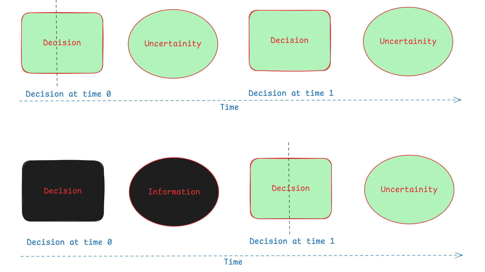
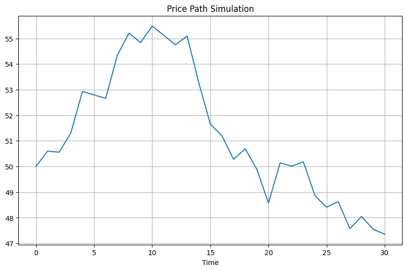
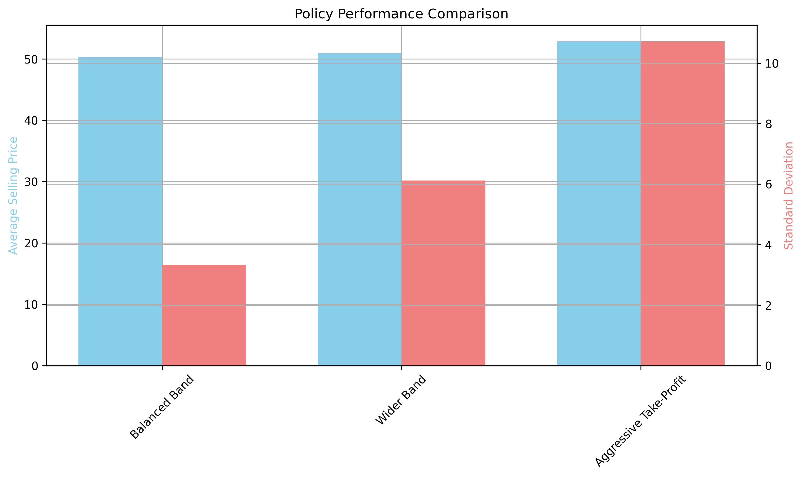
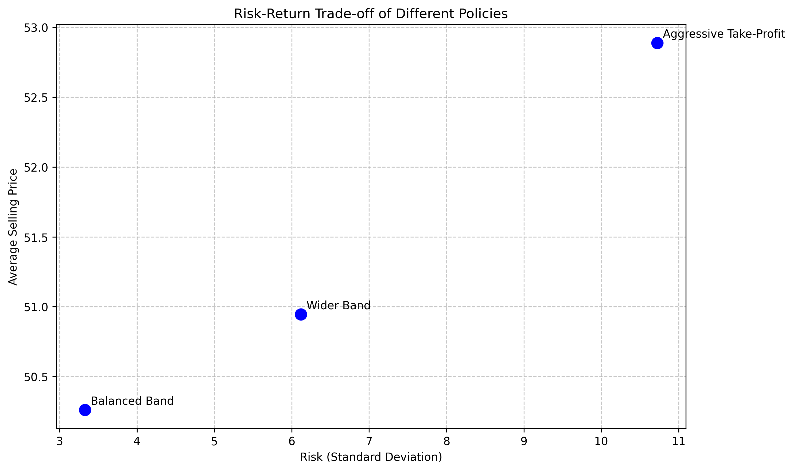

# To Hold or to Sell: Mastering Sequential Decision Analytics in Financial Markets with Simple Policy Rules

## The Core Idea

Sequential decision making represents a powerful framework for tackling problems where decisions and uncertainty alternate. The common idea is that the decision maker will make a decision, then the uncertainty will be revealed, then the decision maker will make another decision, and so on:

*Decision, uncertainty, decision, uncertainty, ... , decision, uncertainty, decision*



As you can see from the image, at time t=0, the decision maker faces uncertainty, then makes a decision, then the uncertainty is revealed, the revealed uncertainty is now information, and the decision maker will make new decision based on the information, at time t=1, where the information was revealed between t=0 and t=1. This process continues until the decision maker makes the final decision at time t=T. 

While common in finance and real life!, practical implementation methods using Python remain underdeveloped.

In sequential decision problems, the goal is to find the *optimal* decision policy that maximizes expected outcomes.

Here, by policy we mean any function that maps your state to the action. However, finding truly *optimal* policies is often computationally infeasible. While methods like Dynamic Programming and Reinforcement Learning exist, they can be impractical for complex problems.

Instead, we can use *heuristic* (Policy Function Approximation maybe better term) methods to find *good-enough* policies that are simple, improvable, and most importantly, easily explainable to stakeholders. These methods rely on tunable parameters that can be optimized through simulation to discover policies that perform well in practice.

To illustrate this idea, let's consider a simple example: The Asset Selling Problem.

I got this example from the book *Sequential Decision Analytics and Modeling* by [Warren Powell](https://www.amazon.com/Sequential-Decision-Analytics-Modeling-Foundations/dp/1638280827). I refer to the book for the details of the problem and the solution. The book is indeed a great resource by Warren Powell.

## The Asset Selling Problem

Consider this scenario: You hold shares of stock (let's say NVIDIA) and need to decide when to sell within a 30-day horizon. The stock price follows an uncertain process, and your goal is to maximize your profit.

The question becomes: what decision policy should you use?

We can model this using:

1. **State Variables**:
   - Physical state (R_t): Whether we're still holding the asset (1) or have sold it (0)
   - Informational state (p_t): The current price of the stock

2. **Decision Variables**:
   - Whether to sell (x_t = 1) or hold (x_t = 0) at each time step

3. **Price Evolution**:
   - The price evolves according to p_t+1 = p_t + price_change_{t+1}
   - The price change follows a probability distribution (in our example, a normal distribution)
   - In the our example, the price change comes from normal distribution with mean 0.1 and standard deviation 2. That means the price will have upward drift of 0.1 on average. 
   - The below is one plot of the price evolution:

  

1. **Objective**:
   - We want to find a policy that maximizes the expected profit, when we sell the asset. It means that, we need to run the simulation many times, and see which policy gives us the highest profit on average.

## Simple Policy Approach

We designed and evaluated a simple "High-Low" policy with tunable thresholds:

```
Sell if: price < lower_threshold OR price > upper_threshold
Otherwise: Hold
```

This policy sells when the price drops too low (cutting losses) or rises high enough (taking profits).

<!-- Visualization 3: A single price path with horizontal lines showing the upper and lower thresholds, and a marker indicating when the policy would sell the asset -->

By simulating thousands of potential price paths, we can evaluate:
1. The average selling price achieved by different policy parameters
2. The risk (standard deviation) associated with each policy


## Design of Three Heuristic Policies

We evaluated three heuristic policies for this problem:

- **Balanced Band** (narrow band): A conservative strategy with θ_low = 48 and θ_high = 52, providing a tight range for selling decisions
- **Wider Band**: A moderate approach with θ_low = 45 and θ_high = 55, allowing more price movement before triggering a sale
- **Aggressive Take-Profit** (wide thresholds): A higher-risk strategy with θ_low = 40 and θ_high = 60, maximizing potential gains while accepting larger drawdowns

For each policy, we can formally define the decision rule (X) as follows:

**Balanced Band Policy**:
$$X^{balanced}(S_t|\theta_{balanced}) = \begin{cases}
1 & \text{If } p_t < 48 \text{ or } p_t > 52\\
1 & \text{If } t = T \text{ and } R_t = 1\\
0 & \text{Otherwise}
\end{cases}$$

**Wider Band Policy**:
$$X^{wider}(S_t|\theta_{wider}) = \begin{cases}
1 & \text{If } p_t < 45 \text{ or } p_t > 55\\
1 & \text{If } t = T \text{ and } R_t = 1\\
0 & \text{Otherwise}
\end{cases}$$

**Aggressive Take-Profit Policy**:
$$X^{aggressive}(S_t|\theta_{aggressive}) = \begin{cases}
1 & \text{If } p_t < 30 \text{ or } p_t > 70\\
1 & \text{If } t = T \text{ and } R_t = 1\\
0 & \text{Otherwise}
\end{cases}$$

## Result of Policies

The below plot shows the average performance of the three policies, and standard deviation of the performance. What we can see here is that the aggressive policy on average has the highest performance, but it comes with higher risk.




The beauty of this approach is that we can present stakeholders with these clear trade-offs, allowing them to select policies that align with their risk tolerance.



## Conclusion

- Sequential decision making is a framework that allows us to frame and solve decision problems in a consistent manner. The idea is first to identify and model the essential elements of the problem (states, decisions, uncertainty, objective), then to design and evaluate simple heuristic policies as starting point.

- Then, through the power of simulation, we can evaluate and compare the performance of different policies, and select the best one based on the stakeholder's risk tolerance.

- It seems starting with simple policies is a good idea, as it allows us to quickly iterate and improve the policy, while communicating the results to stakeholders in a way that is easy to understand.